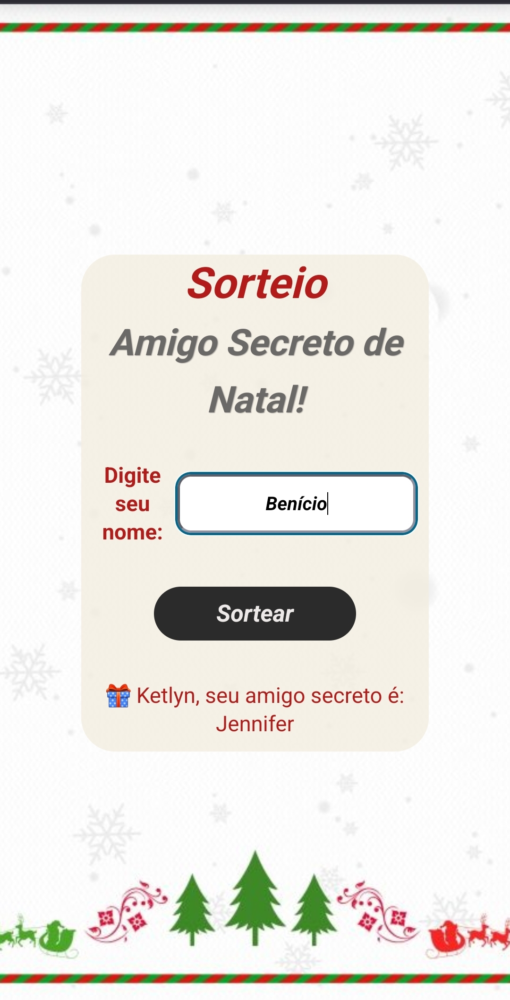

# 🎁 Amigo Secreto de Natal 2025

## 🚀 Sobre o Projeto

Aplicação Full-Stack desenvolvida para realizar sorteios de Amigo Secreto de forma justa, garantindo que cada participante sorteie e seja sorteado apenas uma única vez, sem repetição.

Este projeto foi uma excelente oportunidade para aplicar lógica de processos e refatoração de arquitetura de dados.

## ✨ Funcionalidades

* Sorteio justo: Ninguém tira a si mesmo.
* **Estado do Jogo Robusto:** Implementação de um sistema de duas listas (`sorteadores` e `elegiveis`) para garantir que o ciclo de sorteio seja completo (todos sorteiam e todos são sorteados).
* Gerenciamento de Pares: Rota `/admin/pares` para gerenciar os resultados em caso de falhas de rede.
* Desenvolvimento Front-end Responsivo (incluindo correção do bug `100vh` no iOS).
* Envio do sorteio via clique ou tecla Enter (desktop/mobile).

## 🛠️ Tecnologias Utilizadas

* **Backend:** Node.js, Express.js
* **Dados:** JSON com sistema de arquivos (FS)
* **Frontend:** HTML5, CSS3, JavaScript
* **Hospedagem:** Render (Web Service)

## 📌 Como Rodar Localmente

1. Clone o repositório: `git clone "https://github.com/ViniLara25/Amigo-Secreto"`
2. Instale as dependências: `npm install`
3. Inicie o servidor: `npm start`
4. Acesse: `http://localhost:3000`

---
*Desenvolvido por Vinicius S. de Lara - www.linkedin.com/in/viniciuslaradev/*

